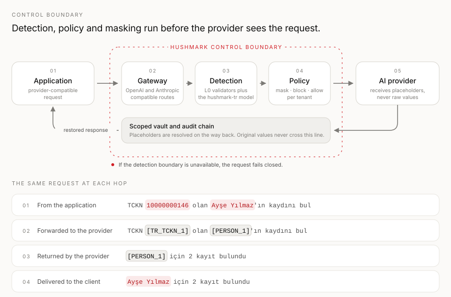
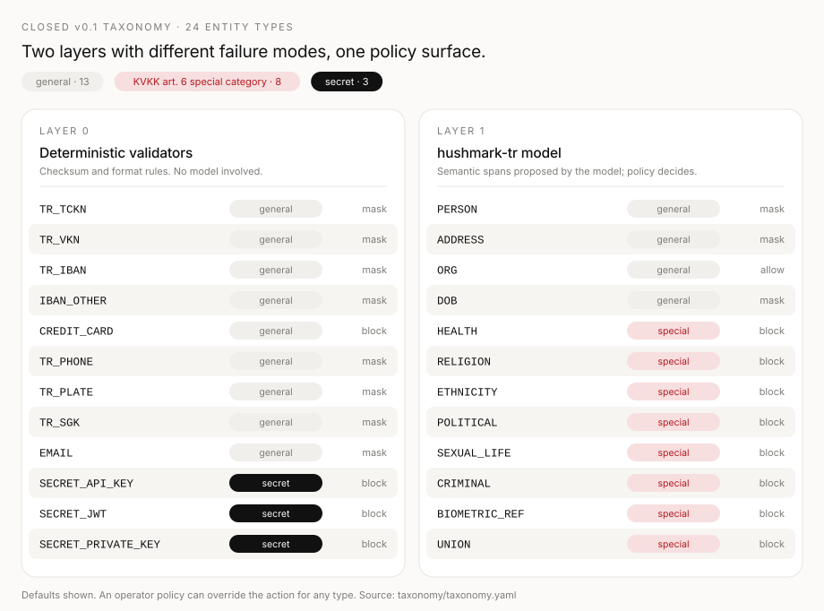
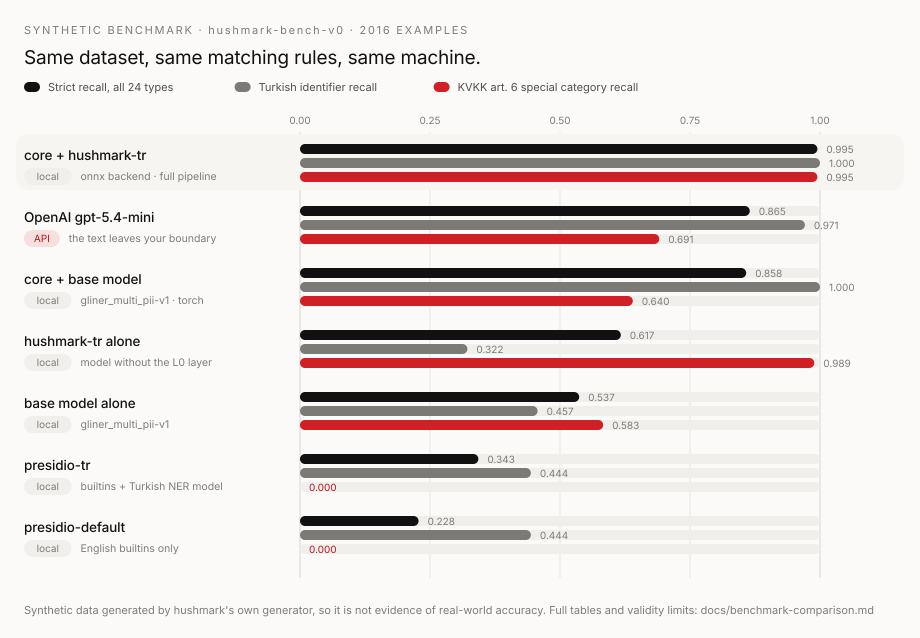

<p align="center">
  
</p>

<h1 align="center">Hushmark</h1>

<p align="center"><strong>Turkish-first PII detection, reversible masking, and controlled restoration for AI traffic.</strong></p>

<p align="center">
  Detect what is about to leave your boundary, replace it with scoped placeholders,<br>
  forward only the masked request, and restore the answer on the way back.
</p>

<p align="center">
  <a href="https://github.com/lokomotifai/hushmark/actions/workflows/ci.yml"></a>
  <a href="https://github.com/lokomotifai/hushmark/actions/workflows/supply-chain.yml"></a>
  <a href="https://github.com/lokomotifai/hushmark-open-core/releases/latest"></a>
  <a href="LICENSE"></a>
</p>

<p align="center">
  <a href="https://www.python.org/"></a>
  <a href="https://nodejs.org/"></a>
  <a href="https://huggingface.co/lokomotifai/hushmark-tr-289m"></a>
  <a href="taxonomy/taxonomy.yaml"></a>
  <a href="README.tr.md"></a>
</p>

<p align="center">
  <a href="#start-in-five-minutes"><strong>Start in five minutes</strong></a>
  ·
  <a href="#what-the-measurements-say"><strong>See the measurements</strong></a>
  ·
  <a href="docs/security.md"><strong>Read the security model</strong></a>
  ·
  <a href="README.tr.md"><strong>Türkçe</strong></a>
</p>

---

> **The policy is never the model's to decide.** A model may propose that a span looks like a
> person's name. It cannot choose the action, resolve a placeholder, widen a scope, or decide that
> a request is safe to forward.

Hushmark keeps sensitive Turkish data inside your control boundary before requests reach an AI
provider. It combines deterministic recognizers with a fine-tuned Turkish PII model, applies an
explicit policy, replaces sensitive spans with placeholders, and restores supported responses
through a self-hosted gateway.

> [!IMPORTANT]
> Reversible masking is a technical security measure—not anonymization, legal advice, or a
> compliance guarantee. Detection can miss or misclassify content. Validate Hushmark against
> representative data and keep human and organizational controls in place.

## The mechanism in one picture



Most privacy tooling stops at "find the PII." Hushmark is concerned with what happens around that
detection:

| Question                                    | Hushmark's answer                                                                                              |
| ------------------------------------------- | -------------------------------------------------------------------------------------------------------------- |
| What is allowed to leave the boundary?      | A per-tenant policy decision for each entity type, applied before the provider request is built.               |
| Who decides a span is really an identifier? | Checksum and format validators for deterministic types; the model only proposes spans for semantic types.      |
| Where does the original value live?         | A scoped vault inside your deployment. The enterprise runtime encrypts it under a KMS envelope.                |
| What happens if detection is unavailable?   | The request fails closed. There is no unmasked fallback path.                                                  |
| What can end up in provider logs?           | Placeholders for supported identifiers, not the raw span.                                                      |
| What can you show after an incident?        | An HMAC-SHA-256 audit chain with an external append-only head checkpoint, and a KVKK article 12 Tedbir report. |

## Start in five minutes

Prerequisites: Node.js 22, pnpm 10.34.4 (pinned by `packageManager`), Python 3.12, uv, Docker with
Compose v2, and at least 8 GiB of free memory for the ONNX model stack.

```bash
git clone https://github.com/lokomotifai/hushmark.git
cd hushmark
./scripts/bootstrap.sh
docker compose -f deploy/docker/compose.yaml -f deploy/docker/compose.dev.yaml up -d --build
curl --fail http://127.0.0.1:8080/readyz
```

`bootstrap.sh` installs the locked Node and Python workspaces, then fetches the pinned model
revision and verifies every file against the SHA-256 digests in
[`core/models.yaml`](core/models.yaml). Weights are never committed to Git and never regenerated
implicitly; set `HUSHMARK_FETCH_MODELS=0` to skip the download on a machine that already has them.

Send a request through the evaluation stack, which routes to a bundled fake upstream. The key
below is the evaluation profile's built-in credential, not a secret; the production profiles use
file-backed secrets instead:

```bash
export HUSHMARK_API_KEY="$(grep -oE 'hm_k1_[a-z_]+' deploy/docker/compose.yaml | head -1)"

curl --fail --show-error \
  -H "authorization: Bearer ${HUSHMARK_API_KEY}" \
  -H 'content-type: application/json' \
  --data '{"model":"hushmark-eval","messages":[{"role":"user","content":"TCKN 10000000146 için kaydı bul"}]}' \
  http://127.0.0.1:8080/v1/chat/completions
```

The upstream receives `TCKN [TR_TCKN_1] için kaydı bul`. Your client receives the restored text.
Tear the evaluation state down with the same file pair plus `down -v`.

### From an application

The TypeScript client wraps any AI SDK 7 provider, so masking and restoration happen without
changing your call sites:

```ts
import { createHushmark } from "@hushmark/ai-sdk";
import { createOpenAI } from "@ai-sdk/openai";
import { wrapLanguageModel } from "ai";

const hushmark = createHushmark({
  baseUrl: "http://127.0.0.1:8080",
  apiKey: process.env.HUSHMARK_API_KEY!,
});

const model = wrapLanguageModel({
  model: createOpenAI({ baseURL: hushmark.openaiBaseUrl, apiKey, fetch: hushmark.fetch }).chat(
    "gpt-4.1",
  ),
  middleware: hushmark.middleware(),
});
```

Every request gets a fresh session by default, so a shared singleton cannot mix one end user's
vault entries into another's. Call `hushmark.withSession()` when a conversation needs stable
placeholder continuity, and never share a scoped client between end users.

The Python client speaks to core directly for batch work:

```python
from hushmark_sdk import Hushmark

with Hushmark(core_url="http://127.0.0.1:8000", api_key="hm_k1_replace_me") as client:
    result = client.mask([{"id": "m0", "text": "TCKN 10000000146 olan Ayşe Yılmaz"}])
```

Original values are omitted from the response unless you explicitly pass `include_values=True`.
Runnable versions of both live in [`examples/nextjs-chat`](examples/nextjs-chat/) and
[`examples/python-batch`](examples/python-batch/).

For deployment beyond a laptop: [single-host production Compose](docs/install-compose-production.md),
[Helm](docs/install-helm.md), or the [air-gap bundle](docs/install-airgap.md).

## What it detects



The taxonomy is closed for v0.1 and generated into every language surface from
[`taxonomy/taxonomy.yaml`](taxonomy/taxonomy.yaml), so the Python core, the TypeScript gateway, and
the console cannot drift apart. The split matters because the two layers fail differently:

- **Layer 0** rejects a candidate that fails its rule. A TCKN with a bad checksum, an IBAN that
  fails ISO 7064 mod-97, or a card number that fails Luhn is simply not an entity. There is nothing
  for a model to be uncertain about.
- **Layer 1** proposes spans for types no regular expression can reach—health status, union
  membership, criminal record. Its output is a signal, scored against a threshold, and the policy
  still decides what happens.

Eight of the 24 types are KVKK article 6 special-category data and default to `block` rather than
`mask`, because reversibly masking a health condition still leaves a reversible record of it.

## What the measurements say



| Engine                       | Runs  |  Strict R | Strict P | Strict F1 | TR identifiers | KVKK art. 6 | Coverage |     p50 |
| ---------------------------- | ----- | --------: | -------: | --------: | -------------: | ----------: | -------: | ------: |
| `core` + hushmark-tr (onnx)  | local | **0.995** |    0.996 | **0.996** |      **1.000** |       0.995 |    24/24 |   18 ms |
| `core` + hushmark-tr (torch) | local | **0.995** |    0.997 | **0.996** |      **1.000** |       0.995 |    24/24 |   42 ms |
| OpenAI `gpt-5.4-mini`        | API   |     0.865 |    0.851 |     0.858 |          0.971 |       0.691 |    24/24 | 1044 ms |
| `core` + base model (torch)  | local |     0.858 |    0.858 |     0.858 |          1.000 |       0.640 |    24/24 |   44 ms |
| hushmark-tr alone            | local |     0.617 |    0.931 |     0.742 |          0.322 |       0.989 |    19/24 |   49 ms |
| base model alone             | local |     0.537 |    0.661 |     0.593 |          0.457 |       0.583 |    22/24 |   49 ms |
| `presidio-tr`                | local |     0.343 |    0.579 |     0.431 |          0.444 |       0.000 |     8/24 |   15 ms |
| `presidio-default`           | local |     0.228 |    0.775 |     0.353 |          0.444 |       0.000 |     5/24 |  0.4 ms |

The ablation rows are the interesting part. Neither half of the system is sufficient alone: the
model on its own scores `0.322` on Turkish identifiers because a checksum is a rule to verify
rather than a pattern to learn, while the pipeline on its own scores `0.640` on special-category
types because "union membership" is not something a regular expression can see.

Alternatives were configured the way a competent team using them would, not in their weakest form.
Presidio was run both out of the box and with a Turkish NER model and `TR` phone region; the
remaining gap is that it ships no Turkish identifier recognizers and no special-category coverage.

A frontier LLM asked to extract entities against the same taxonomy is a serious competitor at
`0.865` strict recall, with no training on this taxonomy at all. Three differences do not close
with a better model: it is roughly 57 times slower on a step that runs synchronously in the request
path, its identifier recall is probabilistic (`0.971`) where a checksum is auditable (`1.000`), and
it works by sending the text to a third party—which is the problem a privacy gateway exists to
solve.

> [!NOTE]
> The dataset is synthetic and was produced by Hushmark's own generator, which also produced the
> model's training data. Scores above 0.99 must be read inside that limit. An independent,
> human-written Turkish test set is the most important piece of evidence this measurement does not
> provide. Method, per-type tables, competitor configuration, and the full validity limits are in
> [the engine comparison](docs/benchmark-comparison.md).

## Where the evidence stops

The point of this table is the right-hand column.

| Surface            | Evidence in this repository                                                                                                          | What it does not establish                                                                 |
| ------------------ | ------------------------------------------------------------------------------------------------------------------------------------ | ------------------------------------------------------------------------------------------ |
| Detection core     | Closed 24-type taxonomy, validator and round-trip property tests, strict code-point offsets, 2,016-example synthetic benchmark       | Accuracy on your own Turkish traffic                                                       |
| Gateway            | OpenAI and Anthropic buffered and SSE paths, fail-closed core dependency, rate and body limits, no-body logging tests                | Response-side detection of PII the request never contained                                 |
| Open vault         | Session-scoped placeholders in a TTL- and LRU-bounded in-memory store                                                                | Persistence, multi-instance sharing, or survival across a restart                          |
| Enterprise runtime | KMS envelope vault, RBAC tests, HMAC-SHA-256/JCS audit chain, external append-only head checkpoint, ed25519 offline licensing        | An audited compliance product; evidence quality depends on your custody of the checkpoint  |
| Console            | Turkish-first operator UI with English fallback, CSRF, cookie, and CSP hardening tests                                               | An accessibility conformance certification                                                 |
| Deployment         | Compose evaluation and single-host production profiles, Helm chart with a kind end-to-end test, air-gap bundle, digest-pinned images | Availability, capacity, or upgrade guarantees in your cluster                              |
| Supply chain       | Pinned CI actions, keyless Cosign signatures, SBOM and provenance attestations, build-context and packaging gates                    | That a correctly signed artifact behaves correctly                                         |
| Model              | Public Apache-2.0 checkpoint, pinned revision and per-file digests, Torch/ONNX parity evidence, published model card                 | Coverage of dialects, OCR artifacts, code-switching, or input beyond the 384-token context |

## What Hushmark protects—and what it does not

- **Fail closed.** When the detection boundary is unavailable, the request is refused. Degrading to
  an unmasked forward would defeat the entire control.
- **The boundary is one place.** Detection, policy, and restoration live at a single gateway rather
  than being reimplemented in every application.
- **Masking is not anonymization.** A reversible mapping exists by design, and whoever holds it
  holds the data. That is a custody problem, not a solved one.
- **Detection does not prove absence.** A clean result means nothing configured was found, not that
  the text contains no personal data.
- **Streaming restores, it does not rescan.** SSE responses are restored across chunk boundaries;
  response-side detection of PII that the request did not contain is not part of v0.1.
- **The host owns the rest.** Network isolation, identity, secret storage, retention, backup,
  provider terms, and incident response belong to the deployment that enforces them.

Trust boundaries, a STRIDE analysis with residual risks, and signature verification are documented
in the [security model](docs/security.md).

## Repository map

| Path                                                           | What it holds                                                                                                                              |
| -------------------------------------------------------------- | ------------------------------------------------------------------------------------------------------------------------------------------ |
| [`core/`](core/)                                               | FastAPI detection and masking authority: L0 validators, model runtime, code-point offsets.                                                 |
| [`packages/gateway/`](packages/gateway/)                       | OpenAI- and Anthropic-compatible proxy with buffered and streaming restoration.                                                            |
| [`packages/gateway-enterprise/`](packages/gateway-enterprise/) | Persistent encrypted vault, RBAC, audit chain, offline licensing, Tedbir report. The package name is historical; the source is Apache-2.0. |
| [`apps/console/`](apps/console/)                               | Turkish-first operator console with an English fallback.                                                                                   |
| [`packages/sdk-ts/`](packages/sdk-ts/) · [`sdk-py/`](sdk-py/)  | Typed TypeScript and Python clients.                                                                                                       |
| [`bench/`](bench/) · [`taxonomy/`](taxonomy/)                  | Reproducible evaluation pipeline, competitor adapters, and the closed v0.1 taxonomy.                                                       |
| [`deploy/`](deploy/)                                           | Docker Compose, Helm, production preflight, and air-gap packaging.                                                                         |
| [`docs/`](docs/)                                               | Install guides, configuration reference, API reference, security model, and the model card.                                                |

The smaller [hushmark-open-core](https://github.com/lokomotifai/hushmark-open-core) repository is an
allowlist-generated, source-only release mirror for the detector, gateway, SDKs, benchmark, and
taxonomy. Public releases are tagged there, which is why the release badge above points at it. This
repository is the canonical development history, and both are licensed under Apache-2.0. Send code
changes here first.

## Published artifacts

| Artifact       | Package or image                                                                                                   |
| -------------- | ------------------------------------------------------------------------------------------------------------------ |
| Core           | [`hushmark-core`](https://pypi.org/project/hushmark-core/) · `ghcr.io/lokomotifai/core:0.1.1`                      |
| Gateway        | `ghcr.io/lokomotifai/gateway:0.1.1`                                                                                |
| Console        | `ghcr.io/lokomotifai/console:0.1.1`                                                                                |
| Python SDK     | [`hushmark-sdk`](https://pypi.org/project/hushmark-sdk/)                                                           |
| TypeScript SDK | [`@hushmark/ai-sdk`](https://www.npmjs.com/package/@hushmark/ai-sdk)                                               |
| Shared schemas | [`@hushmark/shared`](https://www.npmjs.com/package/@hushmark/shared)                                               |
| Model          | [`lokomotifai/hushmark-tr-289m`](https://huggingface.co/lokomotifai/hushmark-tr-289m) (Apache-2.0, Torch and ONNX) |

Images are published only from a tag on `main`, signed with keyless Cosign under GitHub Actions
OIDC, and attested with CycloneDX and SPDX SBOMs. The signature identity is the publishing workflow
itself, so you can verify an image without trusting a key we hand you:

```bash
cosign verify \
  --certificate-identity https://github.com/lokomotifai/hushmark/.github/workflows/publish-images.yml@refs/tags/v0.1.1 \
  --certificate-oidc-issuer https://token.actions.githubusercontent.com \
  ghcr.io/lokomotifai/gateway@sha256:<digest>
```

Resolve images by digest: a floating tag is not a release identity. On every pull request the
separate supply-chain workflow rehearses the same build, SBOM, attestation, vulnerability-budget,
and corpus-canary steps against a local registry with an ephemeral key, so a release does not
discover these problems for the first time. Provenance tells you where an artifact came from; it
does not certify how the artifact behaves.

The model is pinned by revision and per-file SHA-256 in [`core/models.yaml`](core/models.yaml), and
the runtime refuses to load a file whose digest does not match.

## Develop the repository

```bash
./scripts/bootstrap.sh   # locked workspaces plus the pinned, verified model
./scripts/verify.sh      # the full local release gate
```

`verify.sh` is a material gate, not a formality. It runs formatting, lint, strict types, tests, and
builds across both language stacks; enforces module boundaries with dependency-cruiser and
import-linter; proves that the generated taxonomy and API reference match their sources; checks
product claim language; and verifies that private strategy material and corpora are excluded from
container build contexts. Smaller loops are available as `pnpm lint`, `pnpm typecheck`,
`pnpm test`, and `uv run pytest`.

Read [CONTRIBUTING.md](CONTRIBUTING.md) before opening a pull request. Commits require
[DCO 1.1](https://developercertificate.org/) sign-off (`git commit -s`); there is no CLA.

## Community contract

| Document                              | What it commits the project to                                                                           |
| ------------------------------------- | -------------------------------------------------------------------------------------------------------- |
| [Contributing](CONTRIBUTING.md)       | Reproducible setup, review standard, DCO sign-off, AI-assisted contribution policy, acceptance criteria. |
| [Governance](GOVERNANCE.md)           | Decision classes, the public RFC and ADR path, conflicts, maintainer transitions, founder-led limits.    |
| [Maintainers](MAINTAINERS.md)         | Named people, scopes, sensitive capabilities, and verified contact routes.                               |
| [Code of Conduct](CODE_OF_CONDUCT.md) | Participation standards, private reporting, and a proportionate response ladder.                         |
| [Security](SECURITY.md)               | Supported versions, private reporting, response targets, safe harbor, and security boundaries.           |
| [Support](SUPPORT.md)                 | The correct help route, useful reproduction data, and the project's support boundary.                    |
| [Roadmap](ROADMAP.md)                 | Current direction and the capabilities Hushmark intentionally does not promise.                          |
| [Name and logo policy](TRADEMARKS.md) | Fair community use without implying endorsement or official status.                                      |

Hushmark is founder-led and developed in public. Governance is designed to decentralize when real
contributors are ready to hold explicit scopes, not on a schedule and not by contribution count.
Contributions of code, documentation, translation, review, triage, evaluation evidence, and
community care all count.

## Documentation

- [Configuration reference](docs/config.md) and [API reference](docs/api-reference.md)
- [Security model](docs/security.md) and [engine comparison](docs/benchmark-comparison.md)
- [Model card](docs/model-card-hushmark-tr.md) and [training pipeline](docs/train-runpod.md)
- [Compose](docs/install-compose.md) · [production Compose](docs/install-compose-production.md) · [Helm](docs/install-helm.md) · [air-gap](docs/install-airgap.md)
- [Operator guide](docs/admin-guide.en.md) ([Türkçe](docs/admin-guide.tr.md)) and [developer setup](docs/README-dev.md)
- [Architecture decisions](docs/adr/) — the reasoning behind the boundaries above

## Project status

Hushmark is an early `0.1.x` release. Interfaces may change on minor bumps before 1.0. Known
limitations and the next priorities are tracked in the [roadmap](ROADMAP.md); released behavior is
separated from unreleased behavior in [CHANGELOG.md](CHANGELOG.md).

## License

Source code is available under the [Apache License 2.0](LICENSE). See [NOTICE](NOTICE),
[THIRD_PARTY_NOTICES.md](THIRD_PARTY_NOTICES.md), and
[ORIGIN_AND_ATTRIBUTION.md](ORIGIN_AND_ATTRIBUTION.md) for attribution. The Hushmark name and logo
are governed separately by [TRADEMARKS.md](TRADEMARKS.md); the license does not grant a right to
imply that a modified distribution is an official Hushmark release. To cite the software, use
[CITATION.cff](CITATION.cff).

---

<p align="center"><strong>Mask before the boundary. Keep the decision outside the model. Restore under policy.</strong></p>
