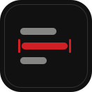
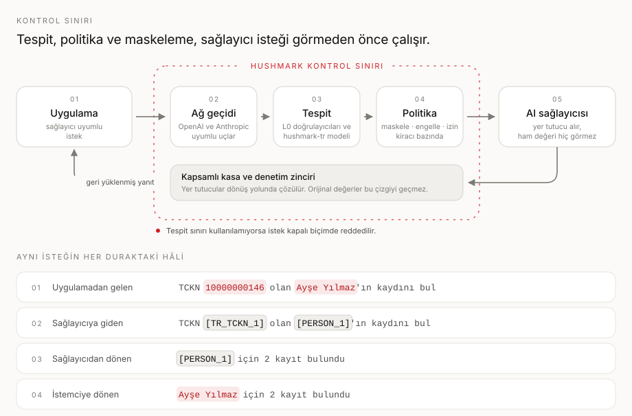
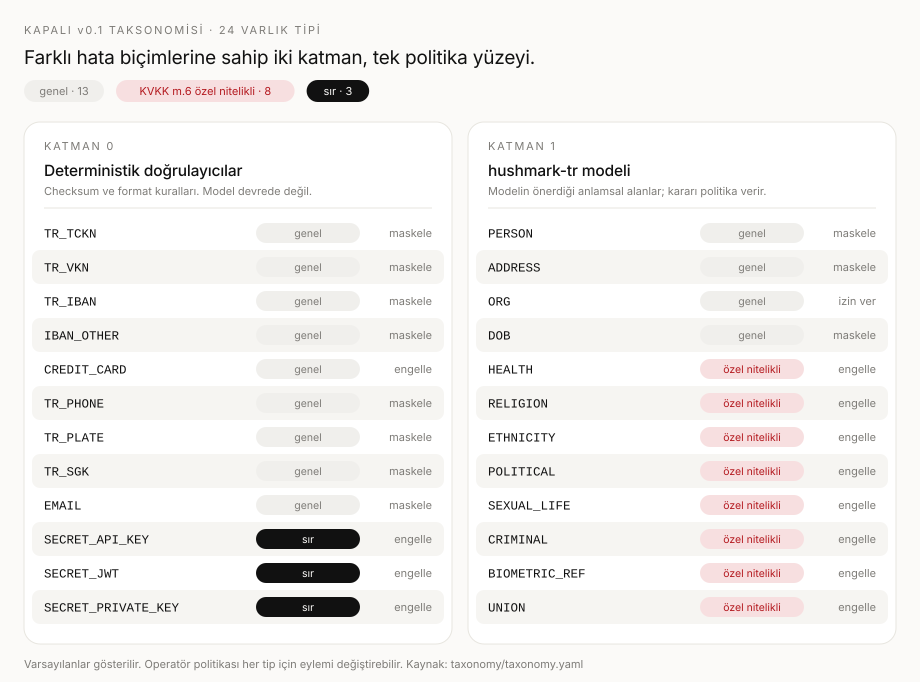
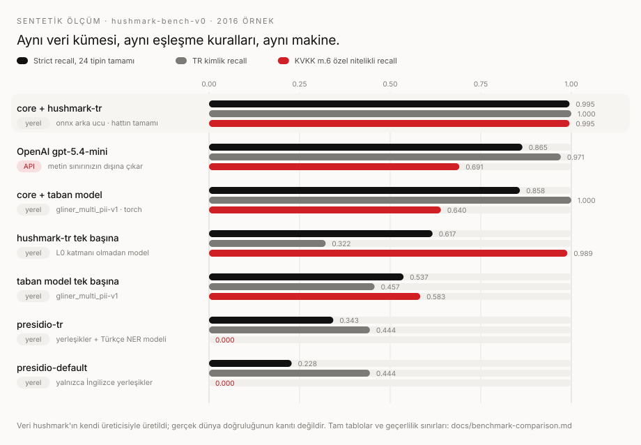

<p align="center">
  
</p>

<h1 align="center">Hushmark</h1>

<p align="center"><strong>Yapay zekâ trafiği için Türkçe odaklı kişisel veri tespiti, geri döndürülebilir maskeleme ve kontrollü geri yükleme.</strong></p>

<p align="center">
  Sınırınızdan çıkmak üzere olanı tespit edin, kapsamlı yer tutucularla değiştirin,<br>
  sağlayıcıya yalnızca maskeli isteği iletin, yanıtı dönüş yolunda geri yükleyin.
</p>

<p align="center">
  <a href="https://github.com/lokomotifai/hushmark/actions/workflows/ci.yml"></a>
  <a href="https://github.com/lokomotifai/hushmark/actions/workflows/supply-chain.yml"></a>
  <a href="https://github.com/lokomotifai/hushmark-open-core/releases/latest"></a>
  <a href="LICENSE"></a>
</p>

<p align="center">
  <a href="https://www.python.org/"></a>
  <a href="https://nodejs.org/"></a>
  <a href="https://huggingface.co/lokomotifai/hushmark-tr-289m"></a>
  <a href="taxonomy/taxonomy.yaml"></a>
  <a href="README.md"></a>
</p>

<p align="center">
  <a href="#beş-dakikada-başlayın"><strong>Beş dakikada başlayın</strong></a>
  ·
  <a href="#ölçümler-ne-söylüyor"><strong>Ölçümleri görün</strong></a>
  ·
  <a href="docs/security.md"><strong>Güvenlik modelini okuyun</strong></a>
  ·
  <a href="README.md"><strong>English</strong></a>
</p>

---

> **Politika kararı modelin değildir.** Bir model, bir alanın kişi adına benzediğini önerebilir.
> Eylemi seçemez, yer tutucuyu çözemez, kapsamı genişletemez ya da bir isteğin iletilmesinin güvenli
> olduğuna karar veremez.

Hushmark, istekler bir yapay zekâ sağlayıcısına ulaşmadan önce hassas Türkçe verileri sizin kontrol
sınırınız içinde tutar. Deterministik tanıyıcıları ince ayar yapılmış bir Türkçe kişisel veri
modeliyle birleştirir, açık bir politika uygular, hassas alanları yer tutucularla değiştirir ve
desteklenen yanıtlarda bu alanları self-hosted ağ geçidi üzerinden geri yükler.

> [!IMPORTANT]
> Geri döndürülebilir maskeleme teknik bir güvenlik tedbiridir; anonimleştirme, hukuki görüş veya
> mevzuata uyum garantisi değildir. Tespitler eksik ya da hatalı olabilir. Hushmark'ı temsilî
> verilerinizle doğrulayın; insan ve organizasyon kontrollerini koruyun.

## Mekanizma tek görselde



Gizlilik araçlarının çoğu "kişisel veriyi bul" adımında durur. Hushmark'ın ilgilendiği şey, o
tespitin etrafında olup bitendir:

| Soru                                                    | Hushmark'ın yanıtı                                                                                               |
| ------------------------------------------------------- | ---------------------------------------------------------------------------------------------------------------- |
| Sınırdan neyin çıkmasına izin var?                      | Her varlık tipi için kiracı bazlı bir politika kararı; sağlayıcı isteği oluşturulmadan önce uygulanır.           |
| Bir alanın gerçekten kimlik olduğuna kim karar veriyor? | Deterministik tipler için checksum ve format doğrulayıcıları; model yalnızca anlamsal tipler için alan önerir.   |
| Orijinal değer nerede duruyor?                          | Kendi dağıtımınızın içindeki kapsamlı bir kasada. Enterprise runtime bunu KMS zarfı altında şifreler.            |
| Tespit kullanılamazsa ne olur?                          | İstek kapalı biçimde reddedilir. Maskesiz bir yedek yol yoktur.                                                  |
| Sağlayıcı kayıtlarına ne düşebilir?                     | Desteklenen tanımlayıcılar için yer tutucular; ham alanın kendisi değil.                                         |
| Olaydan sonra neyi gösterebilirsiniz?                   | Dış, ekleme-yalnızca baş kontrol noktasıyla korunan HMAC-SHA-256 denetim zinciri ve KVKK madde 12 Tedbir raporu. |

## Beş dakikada başlayın

Gereksinimler: Node.js 22, pnpm 10.34.4 (`packageManager` ile sabitlenmiş), Python 3.12, uv,
Compose v2 ile Docker ve ONNX model yığını için en az 8 GiB boş bellek.

```bash
git clone https://github.com/lokomotifai/hushmark.git
cd hushmark
./scripts/bootstrap.sh
docker compose -f deploy/docker/compose.yaml -f deploy/docker/compose.dev.yaml up -d --build
curl --fail http://127.0.0.1:8080/readyz
```

`bootstrap.sh` kilitli Node ve Python çalışma alanlarını kurar, ardından sabitlenmiş model
revizyonunu indirir ve her dosyayı [`core/models.yaml`](core/models.yaml) içindeki SHA-256
özetlerine karşı doğrular. Ağırlıklar Git'e hiç konmaz ve kendiliğinden yeniden üretilmez; modelin
zaten bulunduğu bir makinede indirmeyi atlamak için `HUSHMARK_FETCH_MODELS=0` kullanın.

Değerlendirme yığınına bir istek gönderin; bu yığın paketlenmiş sahte bir upstream'e yönlenir.
Aşağıdaki anahtar, değerlendirme profilinin yerleşik kimlik bilgisidir, bir sır değildir; üretim
profilleri bunun yerine dosya tabanlı sırlar kullanır:

```bash
export HUSHMARK_API_KEY="$(grep -oE 'hm_k1_[a-z_]+' deploy/docker/compose.yaml | head -1)"

curl --fail --show-error \
  -H "authorization: Bearer ${HUSHMARK_API_KEY}" \
  -H 'content-type: application/json' \
  --data '{"model":"hushmark-eval","messages":[{"role":"user","content":"TCKN 10000000146 için kaydı bul"}]}' \
  http://127.0.0.1:8080/v1/chat/completions
```

Upstream `TCKN [TR_TCKN_1] için kaydı bul` metnini alır. İstemciniz geri yüklenmiş metni alır.
Değerlendirme durumunu aynı dosya çiftiyle ve `down -v` ile kaldırın.

### Uygulama tarafından

TypeScript istemcisi herhangi bir AI SDK 7 sağlayıcısını sarmalar; böylece maskeleme ve geri yükleme
çağrı noktalarınızı değiştirmeden çalışır:

```ts
import { createHushmark } from "@hushmark/ai-sdk";
import { createOpenAI } from "@ai-sdk/openai";
import { wrapLanguageModel } from "ai";

const hushmark = createHushmark({
  baseUrl: "http://127.0.0.1:8080",
  apiKey: process.env.HUSHMARK_API_KEY!,
});

const model = wrapLanguageModel({
  model: createOpenAI({ baseURL: hushmark.openaiBaseUrl, apiKey, fetch: hushmark.fetch }).chat(
    "gpt-4.1",
  ),
  middleware: hushmark.middleware(),
});
```

Her istek varsayılan olarak yeni bir oturum alır; böylece paylaşılan bir singleton bir kullanıcının
kasa kayıtlarını bir başkasınınkine karıştıramaz. Bir konuşmanın kararlı yer tutucu sürekliliğine
ihtiyacı olduğunda `hushmark.withSession()` çağırın ve kapsamlı bir istemciyi asla iki son kullanıcı
arasında paylaşmayın.

Python istemcisi toplu işler için doğrudan core ile konuşur:

```python
from hushmark_sdk import Hushmark

with Hushmark(core_url="http://127.0.0.1:8000", api_key="hm_k1_replace_me") as client:
    result = client.mask([{"id": "m0", "text": "TCKN 10000000146 olan Ayşe Yılmaz"}])
```

`include_values=True` açıkça geçilmedikçe orijinal değerler yanıttan çıkarılır. İkisinin de
çalıştırılabilir hâli [`examples/nextjs-chat`](examples/nextjs-chat/) ve
[`examples/python-batch`](examples/python-batch/) içindedir.

Dizüstü bilgisayarın ötesine geçmek için:
[tek sunuculu üretim Compose](docs/install-compose-production.md), [Helm](docs/install-helm.md)
veya [air-gap paketi](docs/install-airgap.md).

## Neleri tespit ediyor?



Taksonomi v0.1 için kapalıdır ve her dil yüzeyine [`taxonomy/taxonomy.yaml`](taxonomy/taxonomy.yaml)
dosyasından üretilir; böylece Python core, TypeScript ağ geçidi ve konsol birbirinden ayrışamaz.
Ayrım önemlidir, çünkü iki katman farklı biçimde hata yapar:

- **Katman 0**, kuralına uymayan adayı reddeder. Checksum'ı tutmayan bir TCKN, ISO 7064 mod-97'yi
  geçemeyen bir IBAN ya da Luhn'u geçemeyen bir kart numarası varlık değildir. Ortada modelin emin
  olamayacağı bir şey yoktur.
- **Katman 1**, hiçbir düzenli ifadenin ulaşamayacağı tipler için alan önerir: sağlık durumu,
  sendika üyeliği, ceza kaydı. Çıktısı bir sinyaldir, bir eşiğe göre puanlanır ve ne olacağına yine
  politika karar verir.

24 tipin sekizi KVKK madde 6 özel nitelikli veridir ve varsayılan eylemleri `mask` değil `block`
olur; çünkü bir sağlık durumunu geri döndürülebilir biçimde maskelemek, o durumun geri
döndürülebilir bir kaydını bırakmaya devam eder.

## Ölçümler ne söylüyor?



| Motor                        | Çalışma |  Strict R | Strict P | Strict F1 | TR kimlik | KVKK m.6 | Kapsam |     p50 |
| ---------------------------- | ------- | --------: | -------: | --------: | --------: | -------: | -----: | ------: |
| `core` + hushmark-tr (onnx)  | yerel   | **0.995** |    0.996 | **0.996** | **1.000** |    0.995 |  24/24 |   18 ms |
| `core` + hushmark-tr (torch) | yerel   | **0.995** |    0.997 | **0.996** | **1.000** |    0.995 |  24/24 |   42 ms |
| OpenAI `gpt-5.4-mini`        | API     |     0.865 |    0.851 |     0.858 |     0.971 |    0.691 |  24/24 | 1044 ms |
| `core` + taban model (torch) | yerel   |     0.858 |    0.858 |     0.858 |     1.000 |    0.640 |  24/24 |   44 ms |
| hushmark-tr tek başına       | yerel   |     0.617 |    0.931 |     0.742 |     0.322 |    0.989 |  19/24 |   49 ms |
| taban model tek başına       | yerel   |     0.537 |    0.661 |     0.593 |     0.457 |    0.583 |  22/24 |   49 ms |
| `presidio-tr`                | yerel   |     0.343 |    0.579 |     0.431 |     0.444 |    0.000 |   8/24 |   15 ms |
| `presidio-default`           | yerel   |     0.228 |    0.775 |     0.353 |     0.444 |    0.000 |   5/24 |  0.4 ms |

Ablasyon satırları asıl ilginç kısımdır. Sistemin hiçbir yarısı tek başına yeterli değildir: model
tek başına Türkçe kimliklerde `0.322` alır, çünkü checksum öğrenilecek bir örüntü değil doğrulanacak
bir kuraldır; hat tek başına özel nitelikli tiplerde `0.640` alır, çünkü "sendika üyeliği" hiçbir
düzenli ifadenin göremeyeceği bir şeydir.

Alternatifler, o motoru kullanan yetkin bir ekibin kuracağı biçimde çalıştırıldı; en zayıf hâlleriyle
değil. Presidio hem kutudan çıktığı gibi hem de Türkçe NER modeli ve `TR` telefon bölgesiyle koşuldu;
kalan açık, Türkçe kimlik tanıyıcılarının ve özel nitelikli kapsamın hiç bulunmamasıdır.

Aynı taksonomiye göre varlık çıkarması istenen güncel bir LLM ciddi bir rakiptir: bu taksonomiyi hiç
görmeden `0.865` strict recall alır. Daha iyi bir modelle kapanmayan üç fark var: istek yolunda
senkron çalışan bir adımda yaklaşık 57 kat daha yavaştır, kimlik recall'ı checksum denetlenebilir
biçimde `1.000` verirken olasılıksal olarak `0.971`dir ve çalışma biçimi metni üçüncü tarafa
göndermektir; yani bir gizlilik ağ geçidinin çözmek için var olduğu sorunun kendisidir.

> [!NOTE]
> Veri kümesi sentetiktir ve Hushmark'ın modelin eğitim verisini de üreten kendi üreticisiyle
> üretilmiştir. 0.99 üzeri skorlar bu sınırın içinde okunmalıdır. Bağımsız, insan yazımı bir Türkçe
> test kümesi, bu ölçümün sağlamadığı en önemli kanıttır. Yöntem, tip bazlı tablolar, rakip
> yapılandırmaları ve geçerlilik sınırlarının tamamı
> [motor karşılaştırmasında](docs/benchmark-comparison.md) yer alır.

## Kanıt nerede bitiyor?

Bu tablonun asıl amacı sağdaki sütundur.

| Yüzey              | Bu depodaki kanıt                                                                                                                         | Neyi kanıtlamaz                                                                                      |
| ------------------ | ----------------------------------------------------------------------------------------------------------------------------------------- | ---------------------------------------------------------------------------------------------------- |
| Tespit çekirdeği   | Kapalı 24 tipli taksonomi, doğrulayıcı ve gidiş-dönüş property testleri, kesin kod noktası ofsetleri, 2.016 örneklik sentetik ölçüm       | Kendi Türkçe trafiğinizdeki doğruluğu                                                                |
| Ağ geçidi          | OpenAI ve Anthropic buffered ve SSE yolları, kapalı-hata core bağımlılığı, hız ve gövde limitleri, gövde loglamama testleri               | İsteğin hiç içermediği kişisel verinin yanıt tarafında tespitini                                     |
| Açık kasa          | TTL ve LRU ile sınırlanmış bellek içi depoda oturum kapsamlı yer tutucular                                                                | Kalıcılığı, çok örnekli paylaşımı ya da yeniden başlatmayı atlatmayı                                 |
| Enterprise runtime | KMS zarflı kasa, RBAC testleri, HMAC-SHA-256/JCS denetim zinciri, dış ekleme-yalnızca baş kontrol noktası, ed25519 çevrimdışı lisanslama  | Denetlenmiş bir uyum ürünü olduğunu; kanıt kalitesi kontrol noktasının sizdeki custody'sine bağlıdır |
| Konsol             | İngilizce yedekli Türkçe öncelikli operatör arayüzü, CSRF, çerez ve CSP sıkılaştırma testleri                                             | Erişilebilirlik uygunluk sertifikasyonunu                                                            |
| Dağıtım            | Compose değerlendirme ve tek sunuculu üretim profilleri, kind uçtan uca testli Helm chart'ı, air-gap paketi, digest'e sabitlenmiş imajlar | Kümenizde erişilebilirlik, kapasite veya yükseltme garantisini                                       |
| Tedarik zinciri    | Sabitlenmiş CI action'ları, keyless Cosign imzaları, SBOM ve provenance tasdikleri, build bağlamı ve paketleme kapıları                   | Doğru imzalanmış bir çıktının doğru davrandığını                                                     |
| Model              | Açık Apache-2.0 checkpoint, sabitlenmiş revizyon ve dosya bazlı özetler, Torch/ONNX parite kanıtı, yayımlanmış model kartı                | Ağız, OCR bozulması, dil karışımı veya 384 token bağlamının ötesindeki girdi kapsamını               |

## Hushmark neyi korur, neyi korumaz?

- **Kapalı hata verir.** Tespit sınırı kullanılamadığında istek reddedilir. Maskesiz iletime düşmek
  kontrolün tamamını anlamsızlaştırırdı.
- **Sınır tek yerdedir.** Tespit, politika ve geri yükleme her uygulamada yeniden yazılmak yerine
  tek bir ağ geçidinde yaşar.
- **Maskeleme anonimleştirme değildir.** Tasarım gereği geri döndürülebilir bir eşleme vardır ve o
  eşlemeyi elinde tutan veriyi elinde tutar. Bu, çözülmüş değil, yönetilmesi gereken bir custody
  sorunudur.
- **Tespit yokluğu kanıtlamaz.** Temiz bir sonuç, yapılandırılmış hiçbir şeyin bulunmadığı anlamına
  gelir; metinde kişisel veri olmadığı anlamına gelmez.
- **Akış geri yükler, yeniden taramaz.** SSE yanıtları parça sınırları boyunca geri yüklenir;
  isteğin içermediği kişisel verinin yanıt tarafında tespiti v0.1 kapsamında değildir.
- **Gerisi barındıranın sorumluluğundadır.** Ağ izolasyonu, kimlik, sır saklama, saklama süreleri,
  yedekleme, sağlayıcı şartları ve olay müdahalesi bunları uygulayan dağıtıma aittir.

Güven sınırları, artık risklerle birlikte STRIDE analizi ve imza doğrulaması
[güvenlik modelinde](docs/security.md) belgelenmiştir.

## Depo haritası

| Yol                                                            | İçeriği                                                                                                                         |
| -------------------------------------------------------------- | ------------------------------------------------------------------------------------------------------------------------------- |
| [`core/`](core/)                                               | FastAPI tespit ve maskeleme otoritesi: L0 doğrulayıcıları, model runtime'ı, kod noktası ofsetleri.                              |
| [`packages/gateway/`](packages/gateway/)                       | Buffered ve akış geri yüklemeli, OpenAI ve Anthropic uyumlu vekil.                                                              |
| [`packages/gateway-enterprise/`](packages/gateway-enterprise/) | Kalıcı şifreli kasa, RBAC, denetim zinciri, çevrimdışı lisanslama, Tedbir raporu. Paket adı tarihseldir; kaynak Apache-2.0'dır. |
| [`apps/console/`](apps/console/)                               | İngilizce yedekli, Türkçe öncelikli operatör konsolu.                                                                           |
| [`packages/sdk-ts/`](packages/sdk-ts/) · [`sdk-py/`](sdk-py/)  | Tip güvenli TypeScript ve Python istemcileri.                                                                                   |
| [`bench/`](bench/) · [`taxonomy/`](taxonomy/)                  | Tekrarlanabilir değerlendirme hattı, rakip adapter'ları ve kapalı v0.1 taksonomisi.                                             |
| [`deploy/`](deploy/)                                           | Docker Compose, Helm, üretim ön kontrolü ve air-gap paketleme.                                                                  |
| [`docs/`](docs/)                                               | Kurulum rehberleri, yapılandırma referansı, API referansı, güvenlik modeli ve model kartı.                                      |

Daha küçük [hushmark-open-core](https://github.com/lokomotifai/hushmark-open-core) deposu; tespit
motoru, ağ geçidi, SDK'lar, benchmark ve taksonomi için allowlist'ten üretilen, yalnızca kaynak kodu
içeren bir sürüm aynasıdır. Genel sürümler orada etiketlenir; yukarıdaki sürüm rozetinin oraya
işaret etmesinin nedeni budur. Bu depo kanonik geliştirme geçmişidir ve iki depo da Apache-2.0 ile
lisanslıdır. Kod değişikliklerini önce buraya gönderin.

## Yayımlanan çıktılar

| Çıktı          | Paket veya imaj                                                                                                   |
| -------------- | ----------------------------------------------------------------------------------------------------------------- |
| Core           | [`hushmark-core`](https://pypi.org/project/hushmark-core/) · `ghcr.io/lokomotifai/core:0.1.1`                     |
| Ağ geçidi      | `ghcr.io/lokomotifai/gateway:0.1.1`                                                                               |
| Konsol         | `ghcr.io/lokomotifai/console:0.1.1`                                                                               |
| Python SDK     | [`hushmark-sdk`](https://pypi.org/project/hushmark-sdk/)                                                          |
| TypeScript SDK | [`@hushmark/ai-sdk`](https://www.npmjs.com/package/@hushmark/ai-sdk)                                              |
| Ortak şemalar  | [`@hushmark/shared`](https://www.npmjs.com/package/@hushmark/shared)                                              |
| Model          | [`lokomotifai/hushmark-tr-289m`](https://huggingface.co/lokomotifai/hushmark-tr-289m) (Apache-2.0, Torch ve ONNX) |

İmajlar yalnızca `main` üzerindeki bir etiketten yayımlanır, GitHub Actions OIDC ile keyless Cosign
kullanılarak imzalanır ve CycloneDX ile SPDX SBOM'larıyla tasdik edilir. İmza kimliği, yayımlayan iş
akışının kendisidir; yani bir imajı, size verdiğimiz bir anahtara güvenmeden doğrulayabilirsiniz:

```bash
cosign verify \
  --certificate-identity https://github.com/lokomotifai/hushmark/.github/workflows/publish-images.yml@refs/tags/v0.1.1 \
  --certificate-oidc-issuer https://token.actions.githubusercontent.com \
  ghcr.io/lokomotifai/gateway@sha256:<digest>
```

İmajları digest ile çözün: hareketli bir etiket sürüm kimliği değildir. Her pull request'te ayrı
tedarik zinciri iş akışı; aynı derleme, SBOM, tasdik, zafiyet bütçesi ve korpus kanaryası adımlarını
yerel bir registry üzerinde geçici bir anahtarla prova eder, böylece bir sürüm bu sorunlarla ilk kez
karşılaşmaz. Provenance bir çıktının nereden geldiğini söyler; nasıl davrandığını tasdik etmez.

Model, [`core/models.yaml`](core/models.yaml) içinde revizyon ve dosya bazlı SHA-256 ile sabitlenir;
runtime, özeti tutmayan bir dosyayı yüklemeyi reddeder.

## Depoyu geliştirmek

```bash
./scripts/bootstrap.sh   # kilitli çalışma alanları ve sabitlenmiş, doğrulanmış model
./scripts/verify.sh      # tam yerel sürüm kapısı
```

`verify.sh` formalite değil, gerçek bir kapıdır. Her iki dil yığınında biçimlendirme, lint, katı
tipler, testler ve derlemeleri çalıştırır; modül sınırlarını dependency-cruiser ve import-linter ile
uygular; üretilen taksonomi ve API referansının kaynaklarıyla eşleştiğini kanıtlar; ürün iddia dilini
denetler; özel strateji materyali ve korpusların konteyner build bağlamlarından dışlandığını
doğrular. Daha küçük döngüler için `pnpm lint`, `pnpm typecheck`, `pnpm test` ve `uv run pytest`
vardır.

Pull request açmadan önce [CONTRIBUTING.md](CONTRIBUTING.md) dosyasını okuyun. Commit'lerde
[DCO 1.1](https://developercertificate.org/) imzası gerekir (`git commit -s`); CLA yoktur.

## Topluluk sözleşmesi

| Belge                                    | Projeyi neye bağlar                                                                                             |
| ---------------------------------------- | --------------------------------------------------------------------------------------------------------------- |
| [Katkı](CONTRIBUTING.md)                 | Tekrarlanabilir kurulum, inceleme standardı, DCO imzası, yapay zekâ destekli katkı politikası, kabul ölçütleri. |
| [Yönetişim](GOVERNANCE.md)               | Karar sınıfları, açık RFC ve ADR yolu, çıkar çatışmaları, bakım devri, kurucu-liderliğinin sınırları.           |
| [Bakımcılar](MAINTAINERS.md)             | İsimler, kapsamlar, hassas yetkiler ve doğrulanmış iletişim kanalları.                                          |
| [Davranış Kuralları](CODE_OF_CONDUCT.md) | Katılım standartları, özel bildirim ve orantılı yaptırım basamakları.                                           |
| [Güvenlik](SECURITY.md)                  | Desteklenen sürümler, özel bildirim, yanıt hedefleri, safe harbor ve güvenlik sınırları.                        |
| [Destek](SUPPORT.md)                     | Doğru yardım kanalı, işe yarar tekrar üretim verisi ve projenin destek sınırı.                                  |
| [Yol haritası](ROADMAP.md)               | Mevcut yön ve Hushmark'ın bilinçli olarak vaat etmediği yetenekler.                                             |
| [Ad ve logo politikası](TRADEMARKS.md)   | Onay ya da resmîlik ima etmeden adil topluluk kullanımı.                                                        |

Hushmark kurucu liderliğinde ve açık biçimde geliştirilir. Yönetişim, gerçek katkıcılar açık
kapsamları üstlenmeye hazır olduğunda merkezsizleşmek üzere tasarlandı; takvime göre ya da katkı
sayısına göre değil. Kod, dokümantasyon, çeviri, inceleme, triyaj, değerlendirme kanıtı ve topluluk
bakımı katkılarının hepsi sayılır.

## Dokümantasyon

- [Yapılandırma referansı](docs/config.md) ve [API referansı](docs/api-reference.md)
- [Güvenlik modeli](docs/security.md) ve [motor karşılaştırması](docs/benchmark-comparison.md)
- [Model kartı](docs/model-card-hushmark-tr.md) ve [eğitim hattı](docs/train-runpod.md)
- [Compose](docs/install-compose.md) · [üretim Compose](docs/install-compose-production.md) · [Helm](docs/install-helm.md) · [air-gap](docs/install-airgap.md)
- [Operatör rehberi](docs/admin-guide.tr.md) ([English](docs/admin-guide.en.md)) ve [geliştirici kurulumu](docs/README-dev.md)
- [Mimari kararlar](docs/adr/) — yukarıdaki sınırların gerekçesi

## Proje durumu

Hushmark erken aşamadaki bir `0.1.x` sürümüdür. Arayüzler 1.0'dan önce minor sürümlerde
değişebilir. Bilinen sınırlar ve sonraki öncelikler [yol haritasında](ROADMAP.md) izlenir; yayımlanan
davranış ile yayımlanmamış davranış [CHANGELOG.md](CHANGELOG.md) içinde ayrılır.

## Lisans

Kaynak kodu [Apache License 2.0](LICENSE) altında sunulur. Atıf için [NOTICE](NOTICE),
[THIRD_PARTY_NOTICES.md](THIRD_PARTY_NOTICES.md) ve
[ORIGIN_AND_ATTRIBUTION.md](ORIGIN_AND_ATTRIBUTION.md) dosyalarına bakın. Hushmark adı ve logosu
ayrıca [TRADEMARKS.md](TRADEMARKS.md) ile yönetilir; lisans, değiştirilmiş bir dağıtımın resmî bir
Hushmark sürümü olduğunu ima etme hakkı vermez. Yazılıma atıf için [CITATION.cff](CITATION.cff)
dosyasını kullanın.

---

<p align="center"><strong>Sınırdan önce maskele. Kararı modelin dışında tut. Politikaya göre geri yükle.</strong></p>
